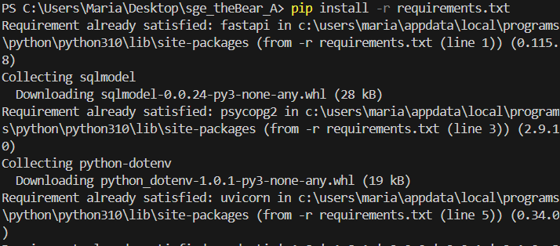

# sge_theBear_A

## PRACTICA 6 
### URL 

### Funcionamiento del endpoint utilizando Swagger

### Endpoint con muestra d einformación de los profesores

### Vista de la terminal 

##  PRACTICA 7 

### Instalación de dependencias 

CAPTURA NUEVA TABLA USER 

A partir del modelo de la tabla que hemos creado en la clase User.py, en la clase main importamos dicho modelo, generamos la conexion con la base de datos, y 