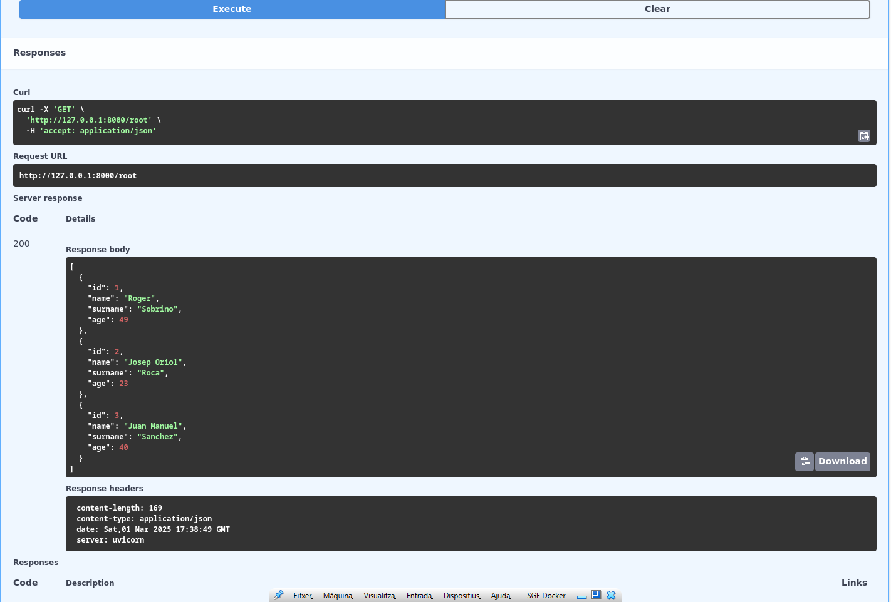
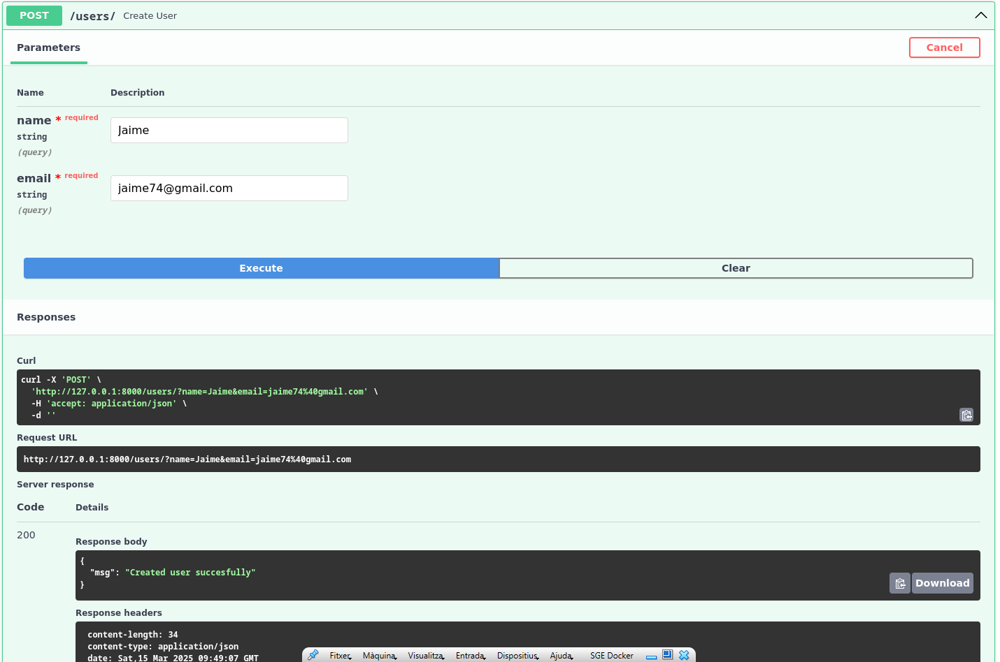
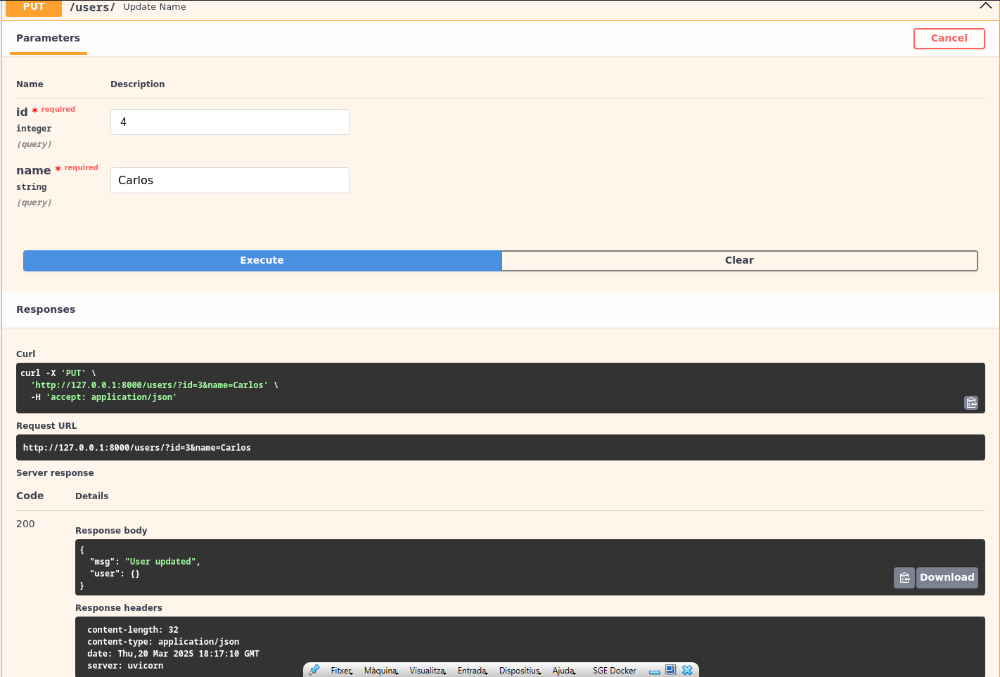
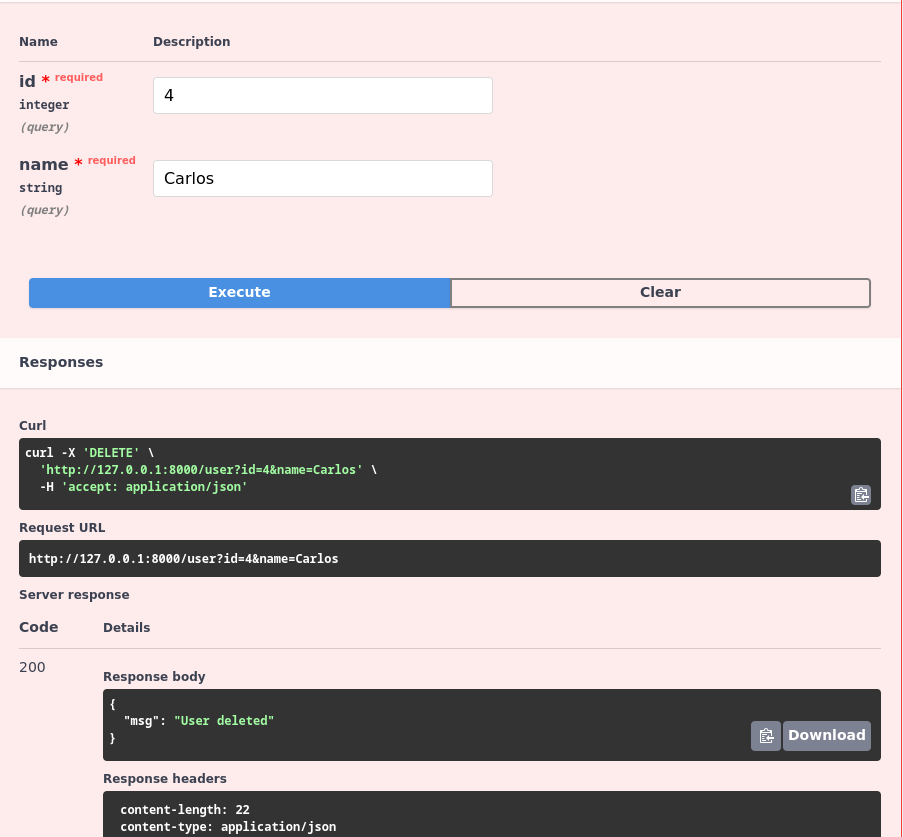
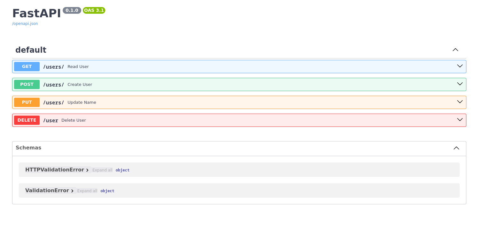

# sge_theBear_A
 
### - Fastapi primeres passes -

**És conceta a la base de dades de PostreSQL i amb la funció read_user i 
la comanda get lleix les dades que es troban a la base de dades de PostreSQL
mostrant els usuaris que hi són.**

### - Fastapi + DB -

**És conceta a la base de dades de PostgreSQL i crear els usuaris amb la funció
create_user li afegirem el diccionari que hi son básicament les dades del usuari**

### - CRUD taula user -

**És conceta a la base de dades de PostgreSQL i actualitza el id i el nom 
de l'usuari gracies a la funció update_name que hi ha al main i que crida a la funció
upadte_user del fitxer user.**
**Un cop modificats les dades del usuari ens retornara 
les dades del usuari actualitzades i mostrant el missatge User updated.**

 

**És conceta a la base de dades de PostgreSQL i esborra al usuari mitjançant l' id de 
l'usuari gracies a la funció delete_user del fitxer main que crida a la funció 
delete.user retornant un missatge que ens mostra: User deleted.**

### Totes les opcions dels usuaris amb els endpoints 

