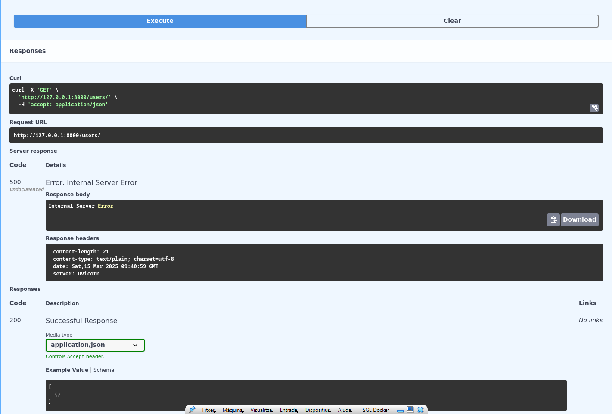
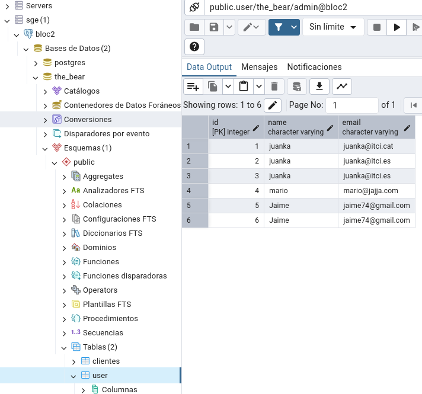

# sge_theBear_A

## Aquesta primera imatge es de l'exercici anterior 
### - Fastapi primeres passes -

### - Fastapi + DB - 
**És conceta a la base de dades de PostreSQL i amb la funció read_user i la comanda get lleix les dades que es troban
a la base de dades de PostreSQL mostrant els usuaris que hi són.**

**És conceta a la base de dades de PostgreSQL i crear els usuaris amb la funció create_user li afegirem el 
diccionari que hi son básicament les dades del usuari**

**Sí tot a sortit bé aquí podras veure els usuaris que hi ha a la base de dades de PostreSQL**

