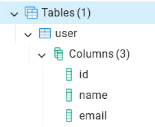
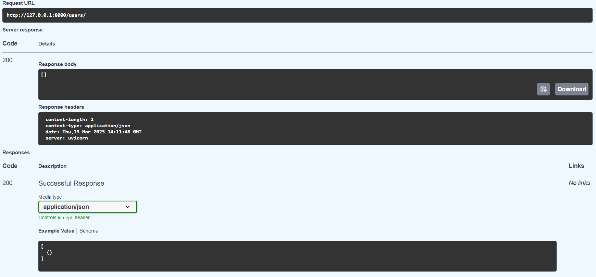
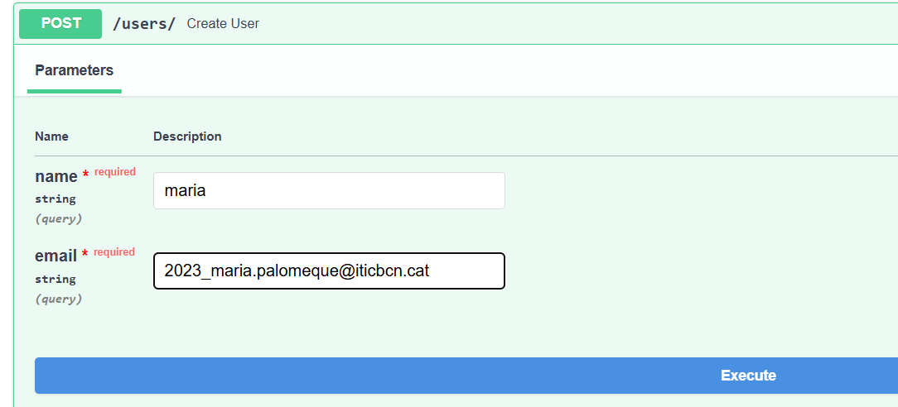
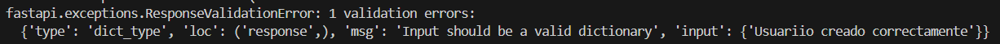
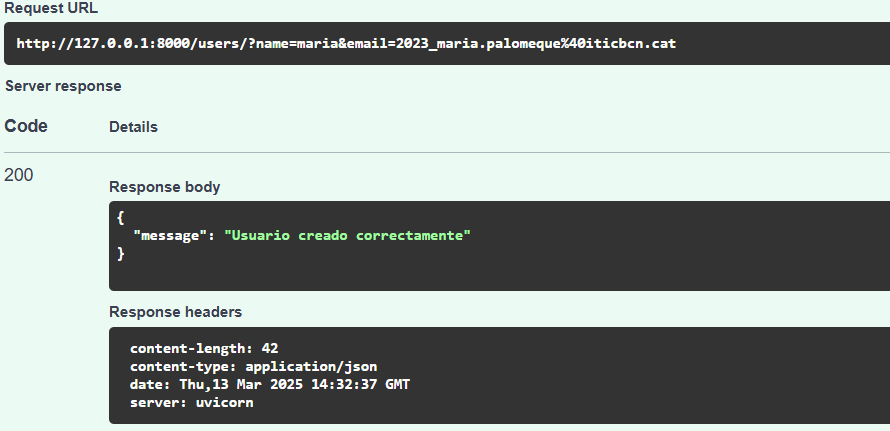

# sge_theBear_A

# 𝒜𝒸𝓉𝒾𝓋𝒾𝓉𝒶𝓉 - 𝒻𝒶𝓈𝓉𝒶𝓅𝒾 𝓅𝓇𝒾𝓂𝑒𝓇𝑒𝓈 𝓅𝒶𝓈𝓈𝑒𝓈
### URL 

### Funcionamiento del endpoint utilizando Swagger

### Endpoint con muestra de información de los profesores

### Vista de la terminal 

# 𝒜𝒸𝓉𝒾𝓋𝒾𝓉𝒶𝓉 - 𝒻𝒶𝓈𝓉𝒶𝓅𝒾 + 𝒹𝒷

### Instalación de dependencias 

Creamos el archivo rquirements.txt en la carpeta principal, el cual al ejecutarlo con la comanda "pip install -r requirements.txt" nos instalara de manera automatica las dependencias requeridas. 

### Creación tabla users 

A continuación crearemos la tabla user partiendo del modelo hemos establecido en la clase User.py (que se encuentra en la carpeta models), que nos indica que constar de los parametros name, email a partre del id. En la clase main importamos dicho modelo, y generamos la conexion con la base de datos. Podemos ver esto refelejado en el pgAdmin:

Actualemnte no encontramos ningun valor en la tabla, para ello necesitamos hacer un insert.

### Introducción valores a la tabla 

Introducimos los paramaetros nombre y correo deseados.  

Al ejecutarlo  nos aparecera el siguiente  error , esto es debido  a que la respuesta a la inserción no es un diccionario.  

El error se encuentra en la linea 20 de el archivo user.py dentro de services. La solución ofrecida es la siguiente : 

return {"message": "Usuario creado correctamente"}

Al establecer una relación clave valor ahora si el codigo interpreta la respuesta como un diccioinario. Ahora si intentamos ejecutar de nuevo conseguimos que funcione correctamente. 

Arreglando el paramegtro ya conseguimos que funcione 

***
### Principales clases de la actividad

En la practica actual partimos de la estructura inicial de la actividad anterior. 

Añadiremos  el archivo requeriments.txt, que como se ha mencionado anteriormente es para instlar las dependencias requeridas en este proyecto. 

También sera necesario crear el fichero .env en la carpeta principal, el codigo varía segun los parametros de acceso a tu base de datos, debes añadir tu usuairo, la contraseña, dirección, puerto  y el nombre del postgres db. 

### Main 
Ampliaremos la clase main, donde haremos un "load_dotenv()"  que nos servira para caragar las variables de entorno. A continuación  haremos la configuración de la conexion con la base de datos. 

Obtener url conexion desde .env: 
"*DATABASE_URL = os.getenv("DATABASE_URL")*"

Crear engine de conexión: 
"*engine =create_engine(DATABASE_URL)*"

Crear las tablas de la base de datos basandose en el modelo: 
"*SQLModel.metadata.create_all(engine)*"

En la clase User.py podemos observar dicho modelo, el caul almacena usuarios en una base de datos con id, name y email. 

A continuacio el siguiente codigo gestiona la sesión de la base de datos: 

*def get_db():
    db = Session(engine)
    try:
        yield db
    finally:
        db.close()*

Seguimos con el endpoint para obtener los usuarios, obtiene la sesión BD, recupera todos los usuariois de la base de datos y los retorna como un diccionario :

*@app.get("/users/", response_model=list[dict])
def read_user(db:Session = Depends(get_db)):
    result =user.get_all_users(db)
    return result*

Proseguimos con el endpoint que crea  un usuario, establece el formato de los parametros, obtiene la sesion BD, hace el llamamiento a "add_new_user" para añadir el nuevo usuario y retorna la confirmación de este: 

*@app.post("/users/", response_model=dict)
def create_user(name: str, email:str, db:Session = Depends(get_db)):
    result = user.add_new_user(name, email, db)
    return result*

