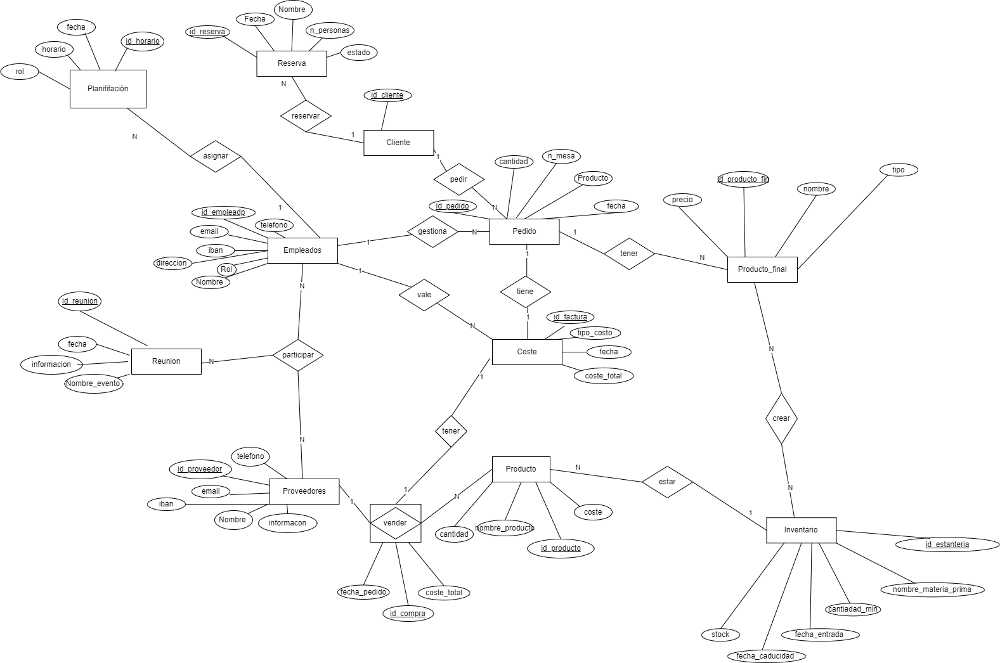
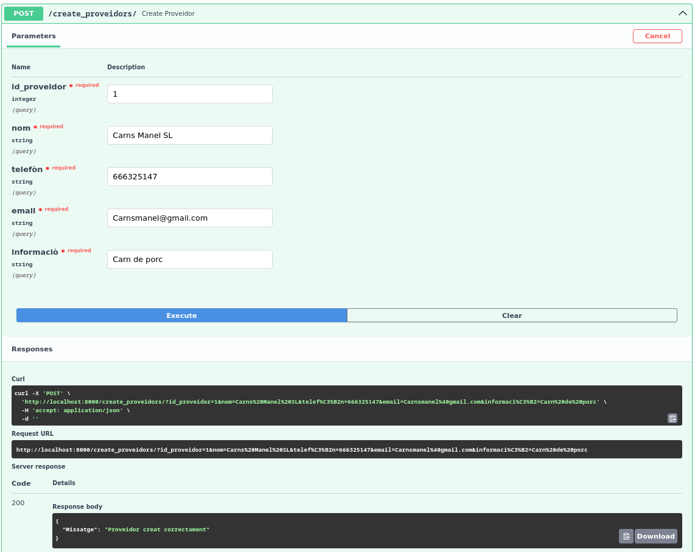

# sge_theBear_A

## Diagrama entidad - relación 

## Captures del Swagger funcionant

# Farem un exemple amb una de les taules del model, en aquest cas amb "Client". Començarem creant un registre amb l'endpoint POST:

Després comprovarem que s'hagi creat satisfactòriament amb els dos mètodes GET que tenim, el primer que mira tots els registres de la taula.

i el següent que mira segons l'id:

Ara actualitzarem el registre creat prèviament. Tenim dos mètodes PUT, un que actualitza tots els camps i altre que només actualitza el camp que l'indiques. 
Aquí veiem el que actualitza tots els camps:

Aquí l'altre:

Comprovem com queda el registre després de les actualitzacions:

Ara esborrarem el registre amb el mètode DELETE:

I comprovem que s'hagi esborrat:

Ara es mostraran la resta de taules en el mateix ordre de captures: crear, mostrar tot, mostrar per id, actualitzar tot i actualitzar el camp seleccionat, mostrar les dades actualitzades, esborrar i mostrar que s'ha esborrat satisfactòriament el registre.

# Taula Planificació

# Taula Proveïdor

# Taula Reunió

# Taula Vendre

# Taula Empleat

# Taula Inventari

